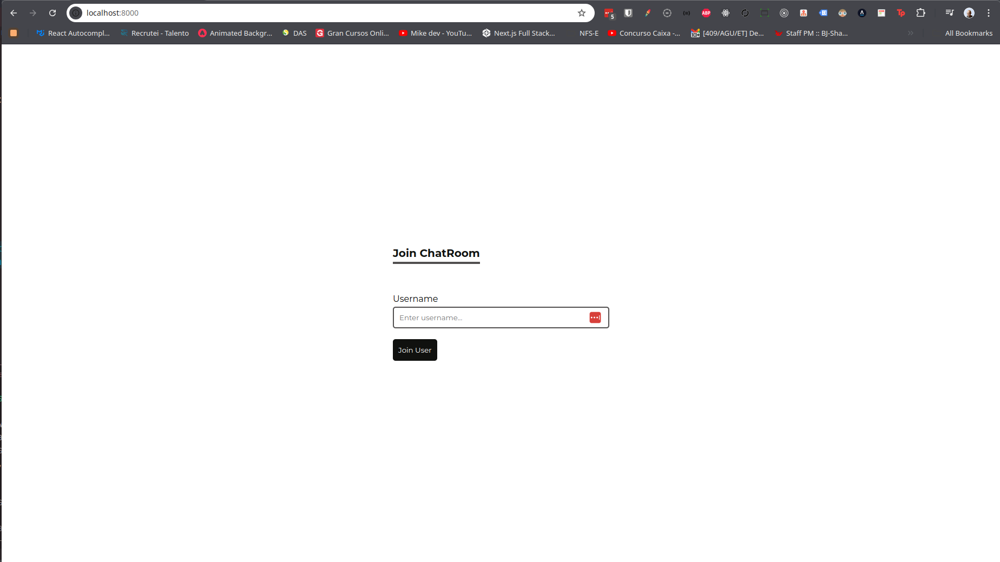
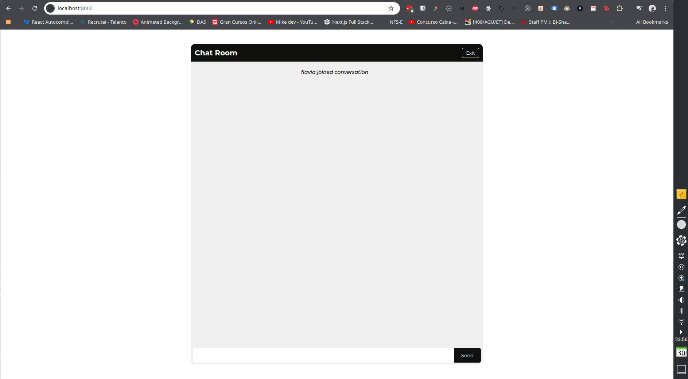

# Real-Time Chat Application

Este é um aplicativo simples de chat em tempo real construído com Node.js, Express e Socket.io. O objetivo do aplicativo é fornecer uma plataforma básica para troca de mensagens em tempo real.

## Funcionalidades

- **Login de Usuário**: Apenas o nome do usuário é necessário para fazer login.
- **Chat em Tempo Real**:
  - Enviar e receber mensagens em tempo real.
  - Notificações de novos usuários entrando e saindo do chat.

## Images

### SignIn



### Chat



## Tecnologias Utilizadas

- **Backend**:

  - [Node.js](https://nodejs.org/)
  - [Express](https://expressjs.com/)
  - [Socket.io](https://socket.io/)

- **Ferramentas de Desenvolvimento**:
  - [Browser-Sync](https://browsersync.io/)
  - [Nodemon](https://nodemon.io/)

## Configuração e Execução

### Pré-requisitos

- [Node.js](https://nodejs.org/)
- [npm](https://www.npmjs.com/)

## Estrutura de Pastas

```arduino
root
├── node_modules
├── public
│   ├── css
│   │   └── main.css
│   └── js
│       └── main.js
├── .gitignore
├── nodemon.json
├── package.json
└── server.js
```

## Como Executar

1. Clone o repositório para o seu ambiente local:

```sh
git clone https://github.com/augustojaml/Real-Time-Chat-Application.git
```

2. Navegue até o diretório do projeto:

```sh
cd repo
```

3. Instale as dependências:

```sh
npm install
```

4. Inicie o servidor:

```sh
npm start:dev
```

4. Inicie o servidor:

```sh
npm start:dev
```

5. Abra o seu navegador e acesse:

```sh
http://localhost:8000
```

### Licença

Este projeto está licenciado sob a Licença MIT - veja o arquivo LICENSE para mais detalhes.

Feito com ❤️ por [José Augusto Monteiro Lima | augustojaml](https://github.com/augustojaml)
